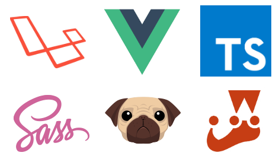

# Laravel Vue Boilerplate

  

A Laravel 8 Single Page Application boilerplate using Vue.js 2.6, GraphQL, Bootstrap 4, TypeScript, Sass and Pug with:

* A users CRUD if the current user is an admin written in RESTful and GraphQL.
* i18n for English, Portuguese and Spanish, based on browser language settings.
* Authentication using Laravel Sanctum.
* WebSockets with Laravel Echo and Pusher.
* Working service worker with Workbox for better PWA development.
* Dockerfile configured with PHP 7.4, Node.js 12 and Composer, with MySQL and phpMyAdmin on Docker Compose.

You can check it live [on this website](https://lvb.as.dev), with the credentials:

Admin user

    E-mail: admin@example.com
    Password: admin

Normal user

    E-mail: normal@example.com
    Password: normal

Notice that all the changed data on that website sample, such as password and CRUD actions, won't be stored.

## Main dependencies

Front-end:

* [Vue](https://github.com/vuejs/vue)
* [VueRouter](https://github.com/vuejs/vue-router)
* [Vuex](https://github.com/vuejs/vuex)
* [vue-apollo](https://github.com/vuejs/vue-apollo)
* [vuex-i18n](https://github.com/dkfbasel/vuex-i18n)
* [Bootstrap 4](https://github.com/twbs/bootstrap)
* [BootstrapVue](https://github.com/bootstrap-vue/bootstrap-vue)
* [Workbox](https://github.com/GoogleChrome/workbox)
* [TypeScript](https://github.com/microsoft/typescript)
* [Pug](https://github.com/pugjs/pug)
* [Sass](https://github.com/sass/node-sass)
* [Laravel Echo](https://github.com/laravel/echo)
* [Laravel Mix](https://github.com/JeffreyWay/laravel-mix)

The TypeScript code tries to follow the [Airbnb JavaScript Style Guide](https://github.com/airbnb/javascript), the linters are already included and configured.

Back-end:

* [Laravel](https://github.com/laravel/laravel)
* [Laravel GraphQL](https://github.com/rebing/graphql-laravel)
* [Laravel Sanctum](https://github.com/laravel/sanctum)
* [laravel-vue-i18n-generator](https://github.com/alefesouza/laravel-vue-i18n-generator)

## Steps to run it:

Remember to search for "TODO change" on the files to change example code.

### With Docker

Run:

    docker-compose up --build

After it starts, just on the first time, run on another terminal:

    docker exec laravel-vue-boilerplate bash -c "composer start && npm start"

The application will be available on http://localhost:8000 and the phpMyAdmin on http://localhost:8081

### Common way

Rename the .env.example file to .env, and fill it with your local info, then:

Install PHP and JavaScript dependencies:

    composer install
    npm install

Generate Laravel keys:

    php artisan key:generate

Generate i18n string for Vue, based on Laravel i18n files:

    php artisan vue-i18n:generate

Migrate and seed the database:

    php artisan migrate --seed

Compile all the front-end stuff:

    npm run prod
